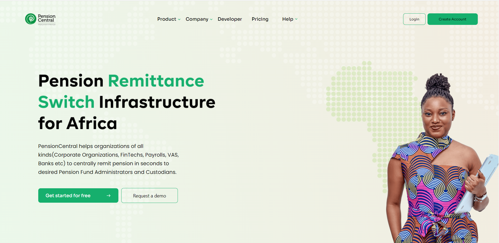

# Installation Process

- Clone the repository (https://github.com/callmefarad/Test-Landing-Page.git).
- Open the cloned repository with your preferred IDE.
- Launch terminal on your IDE and run the command below.
- ```npm install```
- Wait for the complete installation of npm packages required for the application to run.

## Run The App

- Enter the command below to run the app.
- npm start
- Wait until the app fires up automatically on your browser.
- Thanks for having the app right on your desktop
  
## Sample File

